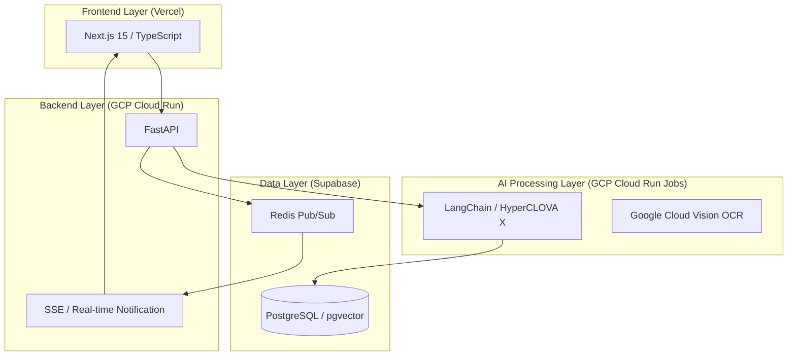

# 🚀 모두취업 (Everything Job)
### AI 기반 취업 지원 에이전트 서비스 (Employment Agent Service)

> **"수많은 채용 공고 속에서 나에게 맞는 기업을 찾는 피로감과 반복되는 자기소개서 작성의 비효율을 해결합니다."**

단순히 공고를 나열하거나 문장을 교정하는 기존 플랫폼의 한계를 넘어, 사용자의 포트폴리오와 GitHub 레포지토리를 심층 분석하고 실시간 채용 데이터(RAG)를 결합하여 **최적의 기업 추천**과 **맞춤형 자소서 초안**을 동시에 제공하는 AI 에이전트 솔루션입니다.

---

## 👥 Project Team (NLP-01)

| 이름 | 역할 | 핵심 업무 |
| :--- | :--- | :--- |
| **강진영** | 프롬프트 엔지니어링 | 자소서 파이프라인 구축 및 최적화 |
| **김지환** | 서버 인프라 | 포트폴리오 파이프라인 및 배포 환경 구축 |
| **박준하** | AI 파이프라인 | 자소서 파이프라인 전략 및 검색 엔진 고도화 |
| **배민석** | 데이터 엔지니어링 | 채용 공고 크롤링 및 하이브리드 추천 로직 구현 |
| **배주연** | AI 파이프라인 | 포트폴리오 분석 및 PDF/OCR 데이터 추출 |
| **정제원** | 데이터 엔지니어링 | 공고 크롤링 파이프라인 및 Reranking 시스템 설계 |

---

## 🏗️ System Architecture

본 서비스는 확장성과 고가용성을 고려하여 클라우드 네이티브 아키텍처로 설계되었습니다.



---

## 🧠 Core LLM Pipelines

### 1. 포트폴리오 파이프라인 (Portfolio Analysis)
다양한 소스(GitHub, Notion, PDF, Blog)에서 프로젝트 경험을 추출하고 구조화합니다.
- **데이터 추출**: `notion-client`, `Gitingest`, `Surya OCR`을 활용하여 텍스트 및 코드 분석.
- **구조화**: HyperCLOVA X (HCX-007)의 **Structured Output** 기능을 통해 프로젝트명, 역할, 기술 스택, 핵심 강점 등을 JSON 형태로 정밀하게 추출.
- **임베딩**: 추출된 데이터를 벡터화하여 사용자만의 '경험 라이브러리' 구축.

### 2. 공고 파이프라인 (Recruitment RAG)
방대한 채용 공고를 수집하고 사용자의 역량에 맞춰 정밀하게 추천합니다.
- **하이브리드 검색**: 의미 기반 **Dense Search**와 형태소 분석(Kiwi) 기반 **Sparse Search(BM25)**를 결합하여 검색 정확도 극대화.
- **다중 관점 쿼리**: 포트폴리오를 기술 스택, 문제 해결, 커리어 맥락 등 3가지 관점으로 분석하여 다각도 공고 탐색.
- **지능형 리랭킹**: HyperCLOVA X Reranker API를 통해 최종 TOP 3 공고를 선별하고 맞춤형 추천 사유 제공.

### 3. 자소서 파이프라인 (Cover Letter Generation)
사용자의 경험과 기업의 요구사항 사이의 **Gap 분석**을 통해 전략적인 자소서를 생성합니다.
- **전략적 배치**: 문항 의도에 최적화된 경험을 자동 매칭하여 논리적 구조(STAR 기법) 설계.
- **신뢰성 확보**: `Temperature 0.0` 설정을 통해 할루시네이션(환각)을 제거하고 사실 기반의 안정적인 품질 유지.
- **멀티 모드 지원**: 핵심 키워드 중심의 '아웃라인 모드'와 소제목을 포함한 '본문 생성 모드' 제공.

---

## 🛠️ Tech Stack

- **Frontend**: Next.js 15 (App Router), Tailwind CSS, shadcn/ui, Zustand
- **Backend**: FastAPI, SQLAlchemy, Pydantic, Alembic
- **AI/LLM**: NCP HyperCLOVA X (HCX-007, HCX-DASH-002), LangChain, CLOVA bge-m3
- **Data**: Supabase (PostgreSQL + pgvector), Redis (Upstash)
- **Infra**: Google Cloud Run / Jobs, Vercel, Google Cloud Vision OCR

---

## 📂 Project Structure

```text
pro-nlp-finalproject-nlp-01/
├── common/             # Shared Code (Models, DB, Schemas) - Single Source of Truth
├── backend/            # Backend API Service (FastAPI)
├── jobs/               # Background Worker Service (Heavy AI Tasks)
├── frontend/           # Frontend Client (Next.js)
├── llm-pipeline/       # Legacy/Experimental LLM Scripts
└── docs/               # Documentation (Architecture, API Specs, Guides)
```

---

## 🚀 Getting Started

상세 실행 방법은 각 디렉토리의 `README.md`를 참고해주세요.

- [Backend Guide](./backend/README.md)
- [Frontend Guide](./frontend/README.md)
- [Collaboration Guide](./docs/conventions/)

---

## 📄 Wrap-Up & Lessons Learned

- **통합 설계의 중요성**: 단일 기능을 넘어 전체 서비스 흐름을 고려한 아키텍처 설계 경험.
- **프롬프트 엔지니어링**: Fine-tuning만큼이나 강력한 프롬프트 제어 전략의 실무적 효과 확인.
- **데이터 품질**: 서비스의 성능이 결국 정교한 데이터 전처리와 구조화에 달려있음을 체감.

더 자세한 프로젝트 과정과 팀원들의 회고는 **[최종 Wrap-Up 리포트](./docs/WRAP_UP_REPORT.md)**에서 확인하실 수 있습니다.
