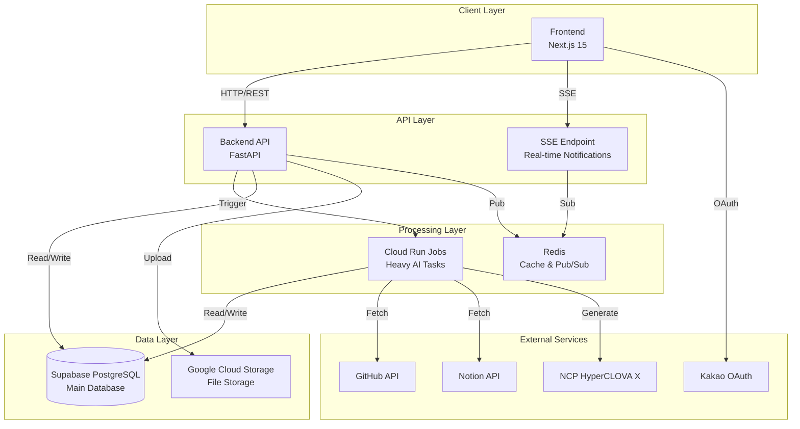
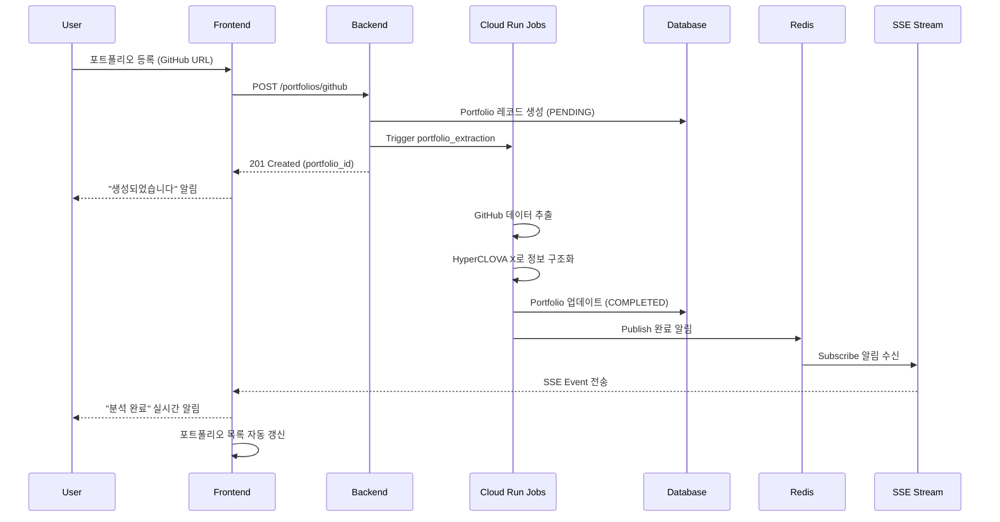
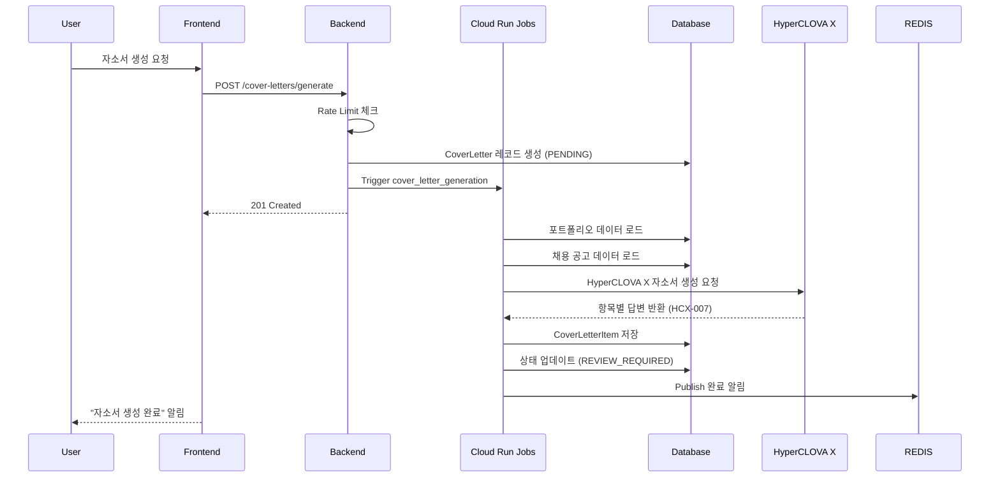
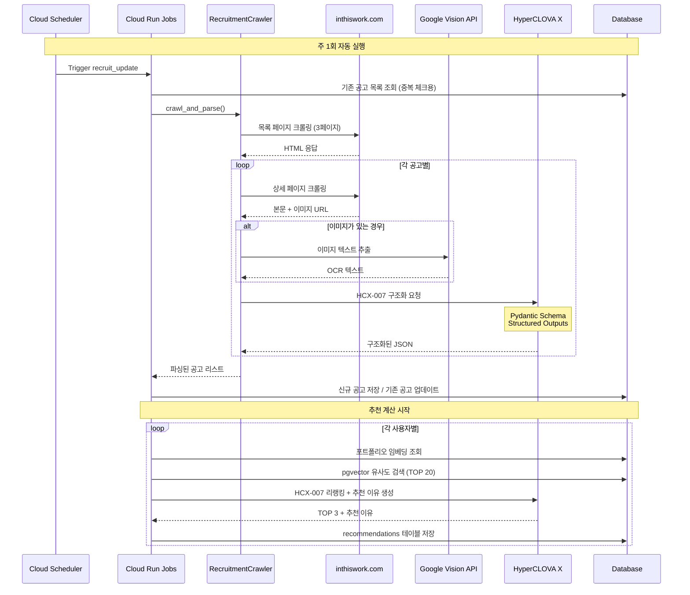
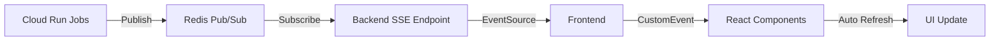
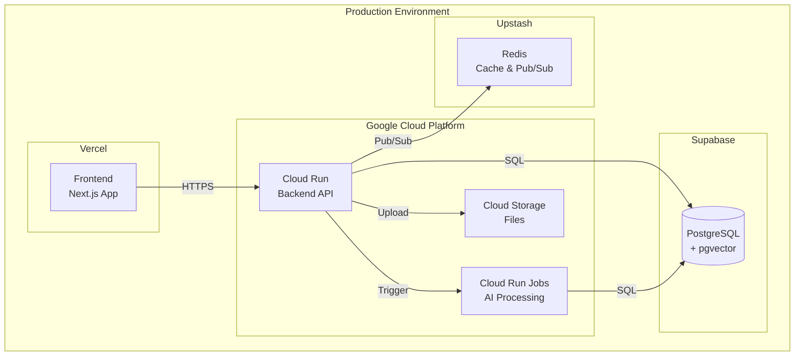

# 프로젝트 아키텍처 문서

## 📋 목차

1. [시스템 개요](#시스템-개요)
2. [전체 아키텍처](#전체-아키텍처)
3. [디렉토리 구조](#디렉토리-구조)
4. [핵심 컴포넌트](#핵심-컴포넌트)
5. [데이터 흐름](#데이터-흐름)
6. [기술 스택](#기술-스택)
7. [배포 구조](#배포-구조)

---

## 🎯 시스템 개요

**프로젝트명**: AI 기반 포트폴리오 분석 및 자소서 생성 플랫폼

### 핵심 기능
1. **포트폴리오 자동 분석**: GitHub, Notion, Blog, 파일 업로드를 통한 프로젝트 경험 추출
2. **AI 자소서 생성**: 포트폴리오 기반 맞춤형 자기소개서 자동 작성
3. **채용 공고 추천**: 사용자 역량 분석 후 적합한 채용 공고 매칭
4. **실시간 알림**: SSE를 통한 비동기 작업 진행 상황 실시간 업데이트

---

## 🏗️ 전체 아키텍처



### 아키텍처 특징

#### 1. **Monorepo 구조**
- 모든 서비스가 하나의 저장소에서 관리
- `common/` 디렉토리를 통한 코드 공유 (Models, Schemas, DB)
- 일관된 데이터 모델 및 타입 정의

#### 2. **비동기 작업 처리**
- 무거운 AI 작업은 Cloud Run Jobs로 분리
- Backend는 즉시 응답, 백그라운드에서 처리
- Redis Pub/Sub으로 작업 완료 알림

#### 3. **실시간 업데이트**
- SSE(Server-Sent Events)로 클라이언트에 실시간 알림
- 페이지 새로고침 없이 상태 업데이트
- Redis를 통한 효율적인 메시지 전달

---

## 📁 디렉토리 구조

### 전체 구조
```
pro-nlp-finalproject-nlp-01/
├── common/              # 공유 코드 (Single Source of Truth)
├── backend/             # FastAPI 백엔드 서버
├── jobs/                # Cloud Run Jobs (AI 작업)
├── frontend/            # Next.js 프론트엔드
├── llm-pipeline/        # 실험용 LLM 스크립트
└── docs/                # 프로젝트 문서
```

---

## 🔧 핵심 컴포넌트

### 1. Common (공유 모듈)

**위치**: `common/`

**역할**: 모든 서비스에서 공통으로 사용하는 코드 정의

```
common/
├── __init__.py          # 패키지 초기화
├── config.py            # 환경 변수 및 설정 (Pydantic Settings)
├── database.py          # DB 연결 및 세션 관리
├── db_init.py           # DB 초기화 및 마이그레이션 헬퍼
├── models.py            # SQLAlchemy ORM 모델 (User, Portfolio, CoverLetter 등)
├── schemas.py           # Pydantic 스키마 (Request/Response 모델)
├── exceptions.py        # 커스텀 예외 클래스
├── gcs_utils.py         # Google Cloud Storage 유틸리티
└── utils/               # 공통 유틸리티 함수
```

#### 주요 파일 설명

**`models.py`** - 데이터베이스 모델
```python
# 주요 모델
- User: 사용자 정보
- Portfolio: 포트폴리오 (GitHub, Notion, Blog, File)
- PortfolioJobQuery: 포트폴리오 분석 작업 추적
- Recruitment: 채용 공고
- Recommendation: AI 추천 결과
- CoverLetter: 자기소개서
- CoverLetterItem: 자소서 항목별 답변
- Notification: 알림
- UserIntegration: 외부 서비스 연동 (GitHub OAuth 등)
```

**`schemas.py`** - API 요청/응답 스키마
```python
# Request 스키마: API 요청 데이터 검증
- PortfolioCreateRequest
- CoverLetterCreateRequest
- UserRegister, UserLogin

# Response 스키마: API 응답 데이터 직렬화
- PortfolioDetail, PortfolioSummary
- CoverLetterDetail
- RecruitmentDetail
```

**`config.py`** - 환경 설정
```python
class Settings(BaseSettings):
    # Database
    DATABASE_URL: str
    
    # External APIs
    GH_OAUTH_CLIENT_ID: str
    GH_OAUTH_CLIENT_SECRET: str
    GH_OAUTH_REDIRECT_URI: str
    GH_API_TOKEN: str
    NOTION_CLIENT_ID: str
    KAKAO_CLIENT_ID: str
    GOOGLE_API_KEY: str
    
    # Cloud
    GCP_PROJECT_ID: str
    GCS_BUCKET_NAME: str
    
    # Redis
    REDIS_HOST: str
    REDIS_PORT: int
```

---

### 2. Backend (API 서버)

**위치**: `backend/`

**역할**: RESTful API 제공, 비즈니스 로직 처리, 인증/인가

```
backend/
├── app/
│   ├── main.py              # FastAPI 앱 진입점
│   ├── api/                 # API 엔드포인트
│   │   ├── deps.py          # 의존성 주입 (인증, DB 세션)
│   │   ├── rate_limit.py    # Rate Limiting
│   │   └── endpoints/       # API 라우터
│   │       ├── auth.py      # 인증 (카카오 OAuth, JWT)
│   │       ├── portfolios.py    # 포트폴리오 CRUD
│   │       ├── cover_letters.py # 자소서 CRUD
│   │       ├── recruits.py      # 채용 공고 조회
│   │       ├── integrations.py  # 외부 서비스 연동
│   │       └── notifications.py # 알림 조회
│   ├── services/            # 비즈니스 로직
│   │   ├── portfolio_service.py     # 포트폴리오 관리
│   │   ├── cover_letter_service.py  # 자소서 관리
│   │   ├── ai_cover_letter_service.py # AI 자소서 생성
│   │   ├── recruit_service.py       # 채용 공고 관리
│   │   ├── job_service.py           # Cloud Run Jobs 트리거
│   │   ├── notification_service.py  # 알림 관리
│   │   └── base_service.py          # 공통 서비스 패턴
│   └── core/                # 핵심 유틸리티
│       ├── security.py      # JWT, 비밀번호 해싱
│       └── sse.py           # Server-Sent Events
├── alembic/                 # DB 마이그레이션
├── requirements.txt         # Python 의존성
└── Dockerfile               # 컨테이너 이미지
```

#### 주요 엔드포인트

| 경로 | 메서드 | 설명 |
|------|--------|------|
| `/auth/kakao/login` | GET | 카카오 OAuth 로그인 |
| `/auth/kakao/callback` | GET | OAuth 콜백 처리 |
| `/auth/me` | GET | 현재 사용자 정보 |
| `/portfolios` | GET, POST | 포트폴리오 목록, 생성 |
| `/portfolios/{id}` | GET, PATCH, DELETE | 포트폴리오 상세, 수정, 삭제 |
| `/portfolios/github` | POST | GitHub 포트폴리오 생성 |
| `/portfolios/notion` | POST | Notion 포트폴리오 생성 |
| `/portfolios/blog` | POST | Blog 포트폴리오 생성 |
| `/cover-letters` | GET, POST | 자소서 목록, 생성 |
| `/cover-letters/generate` | POST | AI 자소서 생성 |
| `/recruits` | GET | 채용 공고 목록 |
| `/recruits/recommend` | GET | AI 추천 공고 |
| `/notifications` | GET | 알림 목록 |
| `/notifications/sse` | GET | SSE 스트림 |

#### 서비스 레이어 설명

**`portfolio_service.py`**
- 포트폴리오 CRUD 작업
- Cloud Run Jobs 트리거 (AI 분석)
- 파일 업로드 처리 (GCS)

**`job_service.py`**
- Cloud Run Jobs API 호출
- 작업 파라미터 전달
- 비동기 작업 관리

**`notification_service.py`**
- 알림 생성 및 조회
- Redis Pub/Sub으로 실시간 전송
- 읽음/안읽음 상태 관리

---

### 3. Jobs (백그라운드 작업)

**위치**: `jobs/`

**역할**: 무거운 AI 작업 처리 (포트폴리오 분석, 자소서 생성, 추천 계산)

```
jobs/
├── run_job.py               # Cloud Run Jobs 진입점
├── tasks/                   # 작업 타입별 핸들러
│   ├── portfolio_task.py    # 포트폴리오 분석
│   ├── cover_letter_task.py # 자소서 생성
│   └── recruit_task.py      # 추천 계산
├── services/                # 작업 비즈니스 로직
│   ├── portfolio_service.py     # 포트폴리오 처리
│   ├── cover_letter_service.py  # 자소서 처리
│   └── recruit_service.py       # 추천 처리
└── core/                    # 핵심 모듈
    ├── portfolio/           # 포트폴리오 처리 파이프라인
    │   ├── extractors/      # 데이터 추출
    │   │   ├── github_extractor.py    # GitHub API + Gitingest
    │   │   ├── notion_extractor.py    # Notion API
    │   │   ├── blog_extractor.py      # Velog/Tistory 스크레이핑
    │   │   └── file_extractor.py      # 파일 파싱
    │   ├── refiners/        # LLM 정제
    │   │   └── gemini_refiner.py      # Gemini API로 구조화
    │   └── storage/         # 벡터 저장
    │       └── supabase_vector_store.py # Supabase pgvector
    └── cover_letter/        # 자소서 생성 파이프라인
        └── generator.py     # Gemini API로 생성
```

#### 작업 흐름

**포트폴리오 분석 (`portfolio_extraction`)**
```
1. Extractor: 소스에서 원본 데이터 추출
   - GitHub: README + 코드 요약 (Gitingest)
   - Notion: 페이지 내용 + 이미지 OCR
   - Blog: 게시글 스크레이핑
   - File: 텍스트 추출

2. Refiner: HyperCLOVA X로 구조화된 JSON 추출
   - 프로젝트명, 기간, 역할, 설명, 기술스택
   - langchain-naver ChatClovaX 사용
   - Single-pass 프롬프트로 비용 절감

3. Storage: DB 저장 + 벡터 임베딩
   - PostgreSQL에 프로젝트 정보 저장
   - Supabase pgvector에 임베딩 저장

4. Notification: 완료 알림 전송
   - Redis Pub/Sub으로 Backend에 알림
   - SSE를 통해 클라이언트에 전달
```

**자소서 생성 (`cover_letter_generation`)**
```
1. 포트폴리오 데이터 로드
2. 채용 공고 정보 로드
3. HyperCLOVA X (HCX-007)로 항목별 답변 생성
   - Gap Analysis: 사용자 경험과 채용 요구사항 분석
   - Resume Generation: 항목별 맞춤 답변 생성
4. DB 저장 및 알림 전송
```

**추천 계산 (`recruit_update`)**
```
1. 사용자 포트폴리오 임베딩 조회 (CLOVA bge-m3)
2. 채용 공고 임베딩과 유사도 계산 (pgvector)
3. 상위 N개 추천 결과 저장
4. 추천 이유 생성 (HyperCLOVA X)
```

**채용 공고 크롤링 (`recruitment_crawling`)**
```
1. Crawler: inthiswork.com에서 IT 채용 공고 수집
   - 페이지별 공고 목록 크롤링 (기본 3페이지)
   - 각 공고의 상세 페이지 방문
   - 본문 텍스트 + 이미지 추출

2. OCR: Google Vision API로 이미지 텍스트 추출
   - 공고 이미지에서 텍스트 자동 인식
   - 본문 텍스트와 병합

3. Parsing: HyperCLOVA X (HCX-007)로 구조화
   - Pydantic 스키마 기반 Structured Outputs
   - 직무별 분리 (한 공고에 여러 직무 → 각각 독립 레코드)
   - 필드: title, company, category, tags, key_responsibilities, 
     required_qualifications, preferred_qualifications 등
   - Rate Limit 처리 (재시도 로직)

4. DB 저장: 중복 체크 후 신규/업데이트
   - (company, title) 조합으로 중복 방지
   - 기존 공고는 업데이트, 신규는 생성
```

#### 채용 공고 크롤링 및 추천 시스템

**위치**: `jobs/core/recruit/`

```
jobs/core/recruit/
├── crawler.py           # 채용 공고 크롤러
├── matcher.py           # AI 매칭 엔진
└── indexer.py           # 벡터 인덱싱
```

**`crawler.py`** - 채용 공고 자동 수집
- **소스**: inthiswork.com (IT 전문 채용 플랫폼)
- **수집 주기**: Cloud Run Jobs 스케줄러 (주 1회)
- **처리 과정**:
  1. 목록 페이지 크롤링 (BeautifulSoup)
  2. 각 공고 상세 페이지 방문
  3. 이미지 OCR (Google Vision API)
  4. HyperCLOVA X로 구조화된 데이터 추출
  5. DB 저장 (중복 체크)

**`matcher.py`** - AI 기반 매칭 엔진
- **기능**:
  - `generate_search_queries()`: 포트폴리오 분석 → 3가지 검색 쿼리 생성
    - Query A: 기술 스택 중심
    - Query B: 성과 중심
    - Query C: 경험 요약
  - `rerank_with_ncp()`: CLOVA Reranker로 후보 정제
  - `rank_and_reason()`: HCX-007로 TOP 3 추천 + 추천 이유 생성

**추천 알고리즘 흐름**:
```
1. 포트폴리오 임베딩 생성 (CLOVA bge-m3)
   └─ 프로젝트 설명 → 벡터 변환

2. 벡터 유사도 검색 (Supabase pgvector)
   └─ 채용 공고 임베딩과 코사인 유사도 계산
   └─ 상위 20개 후보 추출

3. AI 리랭킹 (HyperCLOVA X)
   └─ 포트폴리오 + 공고 후보 → LLM 분석
   └─ TOP 3 선정 + 맞춤형 추천 이유 생성

4. DB 저장 (recommendations 테이블)
   └─ user_id, recruitment_id, score, reason, rank_order
```

---


### 4. Frontend (클라이언트)

**위치**: `frontend/`

**역할**: 사용자 인터페이스 제공, API 호출, 상태 관리

```
frontend/src/
├── app/                     # Next.js App Router
│   ├── (auth)/              # 인증 관련 페이지
│   │   ├── login/           # 로그인
│   │   └── auth/kakao/callback/ # OAuth 콜백
│   ├── (main)/              # 메인 레이아웃
│   │   ├── page.tsx         # 홈 (채용 공고로 리다이렉트)
│   │   ├── recruit/         # 채용 공고
│   │   │   ├── page.tsx     # 목록 (전체/AI 추천)
│   │   │   └── [id]/page.tsx # 상세
│   │   └── my/              # 마이페이지
│   │       ├── dashboard/   # 대시보드
│   │       ├── portfolios/  # 포트폴리오 관리
│   │       │   ├── page.tsx         # 목록
│   │       │   ├── new/page.tsx     # 생성
│   │       │   ├── [id]/page.tsx    # 상세
│   │       │   └── [id]/edit/page.tsx # 수정
│   │       ├── cover-letters/ # 자소서 관리
│   │       │   ├── page.tsx         # 목록
│   │       │   └── [id]/page.tsx    # 상세/수정
│   │       ├── notifications/ # 알림
│   │       └── profile/       # 프로필
│   ├── globals.css          # 전역 스타일
│   └── layout.tsx           # 루트 레이아웃
├── components/              # 재사용 컴포넌트
│   └── ui/                  # shadcn/ui 컴포넌트
├── lib/                     # 유틸리티
│   ├── apiUtils.ts          # API 호출 헬퍼
│   ├── portfolioApi.ts      # 포트폴리오 API 클라이언트
│   ├── recruitApi.ts        # 채용 공고 API 클라이언트
│   └── integrationApi.ts    # 외부 연동 API 클라이언트
├── hooks/                   # Custom Hooks
│   ├── useNotifications.ts  # SSE 알림 훅
│   └── useAuth.ts           # 인증 훅
├── stores/                  # 상태 관리
│   └── useAuthStore.ts      # Zustand 인증 스토어
└── types/                   # TypeScript 타입
    └── index.ts             # 공통 타입 정의
```

#### 주요 기능 컴포넌트

**`useNotifications.ts`** - 실시간 알림
```typescript
// SSE 연결 및 알림 수신
- EventSource로 /notifications/sse 연결
- 알림 수신 시 CustomEvent 발송
- 자동 재연결 로직
```

**`portfolioApi.ts`** - 포트폴리오 API
```typescript
export const portfolioApi = {
  fetchPortfolios: () => Promise<Portfolio[]>,
  createPortfolio: (data) => Promise<Portfolio>,
  updatePortfolio: (id, data) => Promise<Portfolio>,
  deletePortfolio: (id) => Promise<void>,
}
```

**`useAuthStore.ts`** - 인증 상태 관리
```typescript
interface AuthStore {
  isAuthenticated: boolean;
  user: User | null;
  login: (token: string) => void;
  logout: () => void;
}
```

---

## 🔄 데이터 흐름

### 1. 포트폴리오 생성 흐름



### 2. AI 자소서 생성 흐름



### 3. 채용 공고 크롤링 및 추천 흐름



### 4. 실시간 알림 흐름




---

## 🛠️ 기술 스택

### Backend
| 기술 | 용도 | 버전 |
|------|------|------|
| **FastAPI** | Web Framework | 0.115+ |
| **SQLAlchemy** | ORM | 2.0+ |
| **Alembic** | DB Migration | 1.13+ |
| **Pydantic** | Data Validation | 2.0+ |
| **httpx** | HTTP Client | 0.27+ |
| **python-jose** | JWT | 3.3+ |
| **passlib** | Password Hashing | 1.7+ |

### Frontend
| 기술 | 용도 | 버전 |
|------|------|------|
| **Next.js** | React Framework | 15.1+ |
| **React** | UI Library | 19.0+ |
| **TypeScript** | Type Safety | 5.0+ |
| **Tailwind CSS** | Styling | 3.4+ |
| **shadcn/ui** | UI Components | Latest |
| **Zustand** | State Management | 5.0+ |
| **Framer Motion** | Animations | 11.0+ |

### Jobs (AI Processing)
| 기술 | 용도 |
|------|------|
| **NCP HyperCLOVA X** | LLM (자소서 생성, 포트폴리오 구조화) |
| **langchain-naver** | HyperCLOVA X LangChain 통합 |
| **CLOVA bge-m3** | 임베딩 모델 (벡터 검색) |
| **Gitingest** | GitHub 코드 요약 |
| **Notion API** | Notion 페이지 추출 |
| **BeautifulSoup4** | 웹 스크레이핑 |
| **Google Vision API** | 이미지 OCR |

### Infrastructure
| 기술 | 용도 |
|------|------|
| **Supabase PostgreSQL** | Main Database + pgvector |
| **Redis** | Cache + Pub/Sub |
| **Google Cloud Storage** | File Storage |
| **Google Cloud Run** | Backend Hosting |
| **Google Cloud Run Jobs** | Background Processing |
| **Vercel** | Frontend Hosting |

---

## 🚀 배포 구조



### 환경 변수

**Backend (`backend/.env`)**
```bash
# Database
DATABASE_URL=postgresql://...

# External APIs
GH_OAUTH_CLIENT_ID=xxx
GH_OAUTH_CLIENT_SECRET=xxx
GH_OAUTH_REDIRECT_URI=https://your-backend.com/api/integrations/github/callback
GH_API_TOKEN=ghp_xxxxxxxxxxxxx  # Optional: for higher rate limits
NOTION_CLIENT_ID=xxx
NOTION_CLIENT_SECRET=xxx
KAKAO_CLIENT_ID=xxx
KAKAO_CLIENT_SECRET=xxx

# NCP Clova Studio (HyperCLOVA X)
NCP_CLOVASTUDIO_API_KEY=xxx
NCP_CLOVASTUDIO_BASE_URL=https://clovastudio.stream.ntruss.com

# Google APIs (Vision OCR)
GOOGLE_API_KEY=xxx

# Cloud
GCP_PROJECT_ID=xxx
GCS_BUCKET_NAME=xxx
CLOUD_RUN_JOB_NAME=xxx

# Redis
REDIS_HOST=xxx
REDIS_PORT=6379
REDIS_PASSWORD=xxx

# Security
SECRET_KEY=xxx
ALGORITHM=HS256
```

**Frontend (`frontend/.env.local`)**
```bash
NEXT_PUBLIC_API_URL=https://api.example.com
NEXT_PUBLIC_KAKAO_CLIENT_ID=xxx
```

---

## 📊 데이터베이스 스키마

### 주요 테이블

**users** - 사용자
```sql
id, email, name, password_hash, 
desired_job_title, profile_summary,
created_at, updated_at
```

**portfolios** - 포트폴리오
```sql
id, user_id, type (github/notion/blog/file),
source_url, project_name, period, role,
description, tech_stack, content,
processing_status, created_at
```

**portfolio_job_queries** - 포트폴리오 작업 추적
```sql
id, portfolio_id, job_id, status,
started_at, completed_at
```

**recruitments** - 채용 공고
```sql
id, title, company, category, location,
tags, deadline, content, view_count
```

**recommendations** - AI 추천
```sql
id, user_id, recruitment_id,
score, reason, rank_order
```

**cover_letters** - 자소서
```sql
id, user_id, recruitment_id,
processing_status, created_at
```

**cover_letter_items** - 자소서 항목
```sql
id, cover_letter_id, question, answer
```

**notifications** - 알림
```sql
id, user_id, title, message, type,
related_id, is_read, created_at
```

**user_integrations** - 외부 서비스 연동
```sql
id, user_id, platform (github/notion),
access_token, refresh_token, expires_at
```

---

## 🔐 인증 및 보안

### 인증 흐름
1. **카카오 OAuth 2.0**
   - Frontend → Kakao Login
   - Kakao → Backend Callback
   - Backend → JWT 토큰 발급
   - Frontend → localStorage 저장

2. **JWT 토큰**
   - Access Token (1시간)
   - 모든 API 요청 시 `Authorization: Bearer <token>` 헤더

3. **권한 검증**
   - `get_current_user` 의존성으로 인증 확인
   - 리소스 소유권 검증 (user_id 비교)

### 보안 기능
- ✅ HTTPS 강제
- ✅ CORS 설정
- ✅ Rate Limiting (AI 생성 API)
- ✅ Input Validation (Pydantic)
- ✅ SQL Injection 방지 (SQLAlchemy ORM)
- ✅ XSS 방지 (React 자동 이스케이핑)

---

## 📈 성능 최적화

### Backend
- ✅ N+1 쿼리 방지 (`selectinload` 사용)
- ✅ Redis 캐싱 (알림 카운트)
- ✅ 비동기 I/O (FastAPI + asyncio)
- ✅ Connection Pooling (SQLAlchemy)

### Frontend
- ✅ Next.js App Router (Server Components)
- ✅ 이미지 최적화 (next/image)
- ✅ Code Splitting (Dynamic Import)
- ✅ Debouncing (검색 입력)

### Jobs
- ✅ Single-pass LLM 프롬프트 (비용 절감)
- ✅ 10KB 코드 제한 (Gitingest)
- ✅ 병렬 처리 (asyncio.gather)

---

## 🧪 테스트

### Backend
```bash
cd backend
pytest tests/
```

### Frontend
```bash
cd frontend
npm test
```

---

## 📚 추가 문서

- [API 문서](./API_DOCUMENTATION.md)
- [배포 가이드](../backend/DEPLOYMENT_GUIDE.md)
- [테스트 시나리오](./FRONTEND_TEST_SCENARIOS.md)
- [Git 브랜치 전략](./conventions/GIT_BRANCH_STRATEGY.md)
- [커밋 컨벤션](./conventions/COMMIT_CONVENTION.md)

---

## 🤝 기여 가이드

1. `develop` 브랜치에서 feature 브랜치 생성
2. 작업 완료 후 PR 생성
3. 코드 리뷰 후 `develop`에 머지
4. 주기적으로 `main`에 릴리즈

---

## 📞 문의

프로젝트 관련 문의사항은 팀 채널을 통해 공유해주세요.
