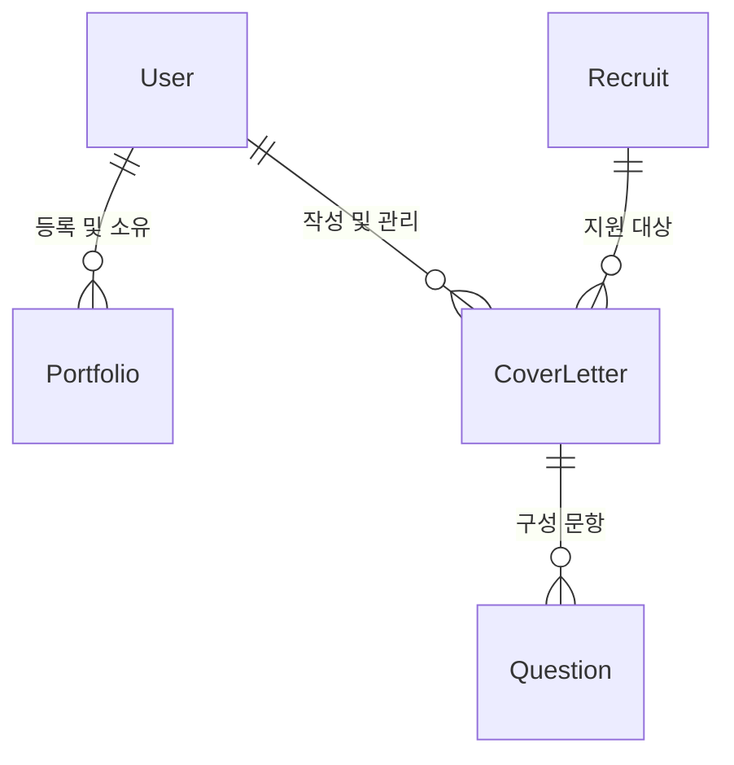

# 데이터 스키마 정의

이 문서는 AI 채용 플랫폼에서 사용하는 데이터 구조(Schema)를 정의합니다. 프로덕션 환경에서 데이터베이스 설계의 기초로 사용됩니다.

## 1. 사용자 (`users`)
사용자 인증 및 기본 프로필 정보를 저장합니다.

| 필드 이름 | 타입 | 설명 |
| :--- | :--- | :--- |
| `id` | Integer (PK) | 고유 식별자 |
| `email` | String (Unique) | 로그인 이메일 |
| `password` | String | 해시된 비밀번호 |
| `name` | String | 사용자 이름 |
| `createdAt` | DateTime | 가입 일시 |

---

## 2. 채용 공고 (`recruits`)
기업의 채용 공고 정보를 저장합니다.

| 필드 이름 | 타입 | 설명 |
| :--- | :--- | :--- |
| `id` | Integer (PK) | 고유 식별자 |
| `title` | String | 공고 제목 |
| `company` | String | 회사 이름 |
| `startDate` | Date | 모집 시작일 |
| `deadline` | Date | 모집 마감일 |
| `tags` | Array<String> | 기술 스택 및 직무 태그 (예: ["React", "Python"]) |
| `content` | Text | 상세 공고 내용 (Markdown 등) |
| `viewCount` | Integer | 조회수 기록 |
| `category` | String | 직무 카테고리 (frontend, backend 등) |

---

## 3. 포트폴리오 (`portfolios`)
사용자가 등록하거나 AI가 분석한 포트폴리오 데이터를 저장합니다.

| 필드 이름 | 타입 | 설명 |
| :--- | :--- | :--- |
| `id` | Integer (PK) | 고유 식별자 |
| `userId` | Integer (FK) | `users.id` 참조 |
| `title` | String | 포트폴리오 제목 (프로젝트명 등) |
| `type` | Enum | `link`(URL), `file`(PDF/문서), `github`(저장소) |
| `url` | String | 링크 또는 GitHub 주소 |
| `fileName` | String | 파일 타입인 경우 원본 파일 이름 |
| `description` | Text | 프로젝트 한 줄 요약 |
| `content` | Text | 분석된 텍스트 내용 또는 추출된 프로젝트 기술서 |
| `createdAt` | DateTime | 생성 일시 |

---

## 4. 자기소개서 (`cover_letters`)
특정 공고에 지원하기 위해 작성된 자기소개서를 저장합니다.

| 필드 이름 | 타입 | 설명 |
| :--- | :--- | :--- |
| `id` | Integer (PK) | 고유 식별자 |
| `userId` | Integer (FK) | `users.id` 참조 |
| `recruitId` | Integer (FK, Nullable) | `recruits.id` 참조 (특정 공고 연결 시) |
| `title` | String | 자기소개서 문서 관리용 제목 |
| `content` | Text | 전체 자기소개서 내용 (또는 문항 통합 내용) |
| `updatedAt` | DateTime | 최종 수정 일시 |

---

## 5. 자소서 문항 (`cover_letter_questions`)
*선택사항: 문항별로 답변을 관리할 경우 사용합니다.*

| 필드 이름 | 타입 | 설명 |
| :--- | :--- | :--- |
| `id` | Integer (PK) | 고유 식별자 |
| `letterId` | Integer (FK) | `cover_letters.id` 참조 |
| `question` | Text | 문항(질문) 내용 |
| `answer` | Text | 답변 내용 |

---

## 데이터 관계도 (ERD)

