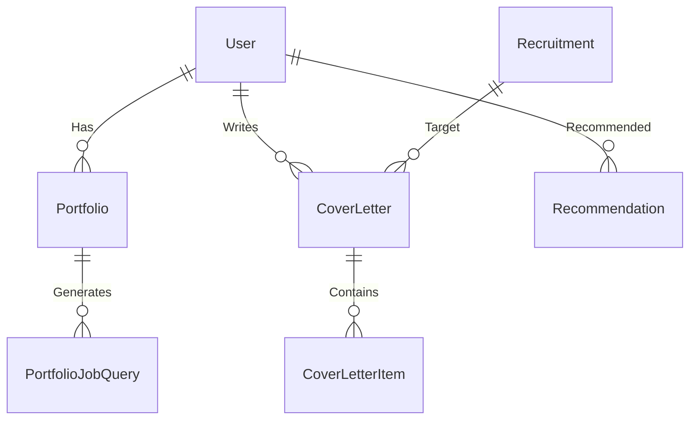

# 데이터 스키마 정의 (Data Schema)

이 문서는 `common/models.py`에 정의된 SQLAlchemy 모델과 1:1로 대응되는 최신 데이터베이스 스키마입니다.

## 1. 사용자 (`users`)
사용자 인증 및 기본 프로필 정보를 저장합니다.

| 필드 이름 | 타입 | 설명 |
| :--- | :--- | :--- |
| `id` | Integer (PK) | 고유 식별자 |
| `email` | String (Unique) | 로그인 이메일 |
| `name` | String | 사용자 이름 |
| `profile_summary` | Text | (AI 분석) 전체 포트폴리오 요약 |
| `desired_job_title` | String | (AI 분석) 희망 직무 |
| `created_at` | DateTime | 가입 일시 |

---

## 2. 채용 공고 (`recruitments`)
기업의 채용 공고 정보를 저장하며, AI 매칭을 위한 임베딩을 포함합니다.

| 필드 이름 | 타입 | 설명 |
| :--- | :--- | :--- |
| `id` | Integer (PK) | 고유 식별자 |
| `title` | String | 공고 제목 |
| `company` | String | 회사 이름 |
| `link` | String | 채용 사이트 원문 링크 |
| `category` | String | 직무 카테고리 (Frontend, Backend, AI 등) |
| `start_date` | Date | 모집 시작일 |
| `deadline` | Date | 모집 마감일 |
| `key_responsibilities` | Text | 주요 업무 (R&R) |
| `required_qualifications` | Text | 필수 자격 요건 |
| `preferred_qualifications` | Text | 우대 사항 |
| `tags` | JSON | 태그 리스트 (예: `["Python", "FastAPI"]`) |
| `embedding` | Vector(1024) | 공고 내용의 벡터 임베딩 (pgvector) |
| `view_count` | Integer | 조회수 |
| `created_at` | DateTime | 생성 일시 |

---

## 3. 포트폴리오 (`portfolios`)
사용자가 등록한 포트폴리오(프로젝트)입니다. 하나의 포트폴리오 = 하나의 프로젝트 단위로 관리됩니다.

| 필드 이름 | 타입 | 설명 |
| :--- | :--- | :--- |
| `id` | Integer (PK) | 고유 식별자 |
| `user_id` | Integer (FK) | `users.id` 참조 |
| `project_name` | String | 프로젝트 명 (Notion/GitHub 제목) |
| `type` | String | `github`, `notion`, `file` |
| `source_url` | String | 원본 링크 |
| `content` | Text | 추출된 원본 텍스트 |
| `description` | Text | (AI 정제) 프로젝트 설명 및 성과 |
| `period` | String | 진행 기간 |
| `role` | String | 담당 역할 |
| `tech_stack` | JSON | 사용 기술 스택 |
| `embedding` | Vector(1024) | 프로젝트 설명의 벡터 임베딩 |
| `processing_status` | Enum | `PENDING`, `COMPLETED`, `FAILED` |
| `created_at` | DateTime | 생성 일시 |

---

## 4. 포트폴리오 직무 질문 (`portfolio_job_queries`)
면접 대비를 위해 포트폴리오에서 생성된 예상 질문입니다.

| 필드 이름 | 타입 | 설명 |
| :--- | :--- | :--- |
| `id` | Integer (PK) | 고유 식별자 |
| `portfolio_id` | Integer (FK) | `portfolios.id` 참조 |
| `type` | String | 질문 유형 (A: 경험, B: 기술, C: 해결) |
| `query_text` | String | 생성된 질문 내용 |
| `evidence` | JSON | 질문 생성의 근거가 된 문장들 |

---

## 5. 자기소개서 (`cover_letters`)
특정 채용 공고에 대해 생성된 자기소개서입니다.

| 필드 이름 | 타입 | 설명 |
| :--- | :--- | :--- |
| `id` | Integer (PK) | 고유 식별자 |
| `user_id` | Integer (FK) | `users.id` 참조 |
| `recruitment_id` | Integer (FK) | `recruitments.id` 참조 |
| `title` | String | 자기소개서 제목 |
| `content` | Text | (Legacy) 전체 내용 (현재는 `items`로 분리됨) |
| `processing_status` | Enum | 상태 (PENDING/COMPLETED) |
| `gap_analysis` | JSON | (AI 분석) 유저 역량 vs 공고 요구사항 차이 분석 |
| `job_analysis` | JSON | (AI 분석) 공고 핵심 키워드 및 의도 분석 |
| `created_at` | DateTime | 생성 일시 |

---

## 6. 자기소개서 문항 (`cover_letter_items`)
자기소개서의 각 문항(지원동기, 성장과정 등)과 답변입니다.

| 필드 이름 | 타입 | 설명 |
| :--- | :--- | :--- |
| `id` | Integer (PK) | 고유 식별자 |
| `cover_letter_id` | Integer (FK) | `cover_letters.id` 참조 |
| `category` | String | 문항 카테고리 (Motivation, Capability 등) |
| `question` | Text | 문항 내용 |
| `content` | Text | 생성된 답변 내용 |
| `key_points` | JSON | 답변에 포함된 핵심 역량/키워드 |
| `suggested_improvements` | JSON | AI 첨삭 제안 |

---

## 7. 추천 채용공고 (`recommendations`)
사용자 분석 기반으로 AI가 추천한 공고 목록입니다. (사용자 중심 통합 결과)

| 필드 이름 | 타입 | 설명 |
| :--- | :--- | :--- |
| `id` | Integer (PK) | 고유 식별자 |
| `user_id` | Integer (FK) | `users.id` 참조 |
| `recruitment_id` | Integer (FK) | 추천된 공고 |
| `reason` | JSON | 추천 사유 리스트 (AI 생성) |
| `rank_order` | Integer | 추천 순위 |

---

## ER Diagram

